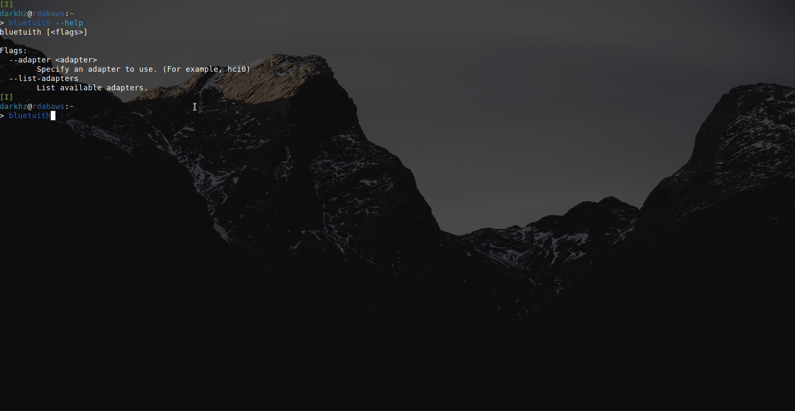

# bluetuith
bluetuith is a TUI-based bluetooth connection manager, which can interact with bluetooth adapters and devices.
It aims to be a replacement to most bluetooth managers, like blueman.

This is only available on Linux.

This project is currently in the alpha stage.

## Features
- Transfer and receive files via OBEX.
- Perform pairing with authentication.
- Connect to/disconnect from different devices.
- Interact with bluetooth adapters, toggle power and discovery states
- Mouse support

## Requirements
- Bluez
- DBus

## Installation
If the `go` compiler is present in your system, you can install it via the following command:
`go install github.com/darkhz/bluetuith@latest`

Or you can navigate to the releases section and download a binary that matches your architecture.

## Usage
    bluetuith [<flags>]

    Flags:
      --adapter <adapter>         Specify an adapter to use. (For example, hci0)
      --list-adapters             List available adapters.

## Keybindings

### Device Screen
|Operation                       |Keybinding                   |
|--------------------------------|-----------------------------|
|Open the menu                   |<kbd>Ctrl</kbd>+<kbd>m</kbd> |
|Navigate between menus          |<kbd>Tab</kbd>               |
|Navigate between devices/options|<kbd>Up</kbd>/<kbd>Down</kbd>|
|Toggle adapter power state      |<kbd>o</kbd>                 |
|Toggle scan (discovery state)   |<kbd>s</kbd>                 |
|Change adapter                  |<kbd>a</kbd>                 |
|Send files                      |<kbd>f</kbd>                 |
|Progress view                   |<kbd>v</kbd>                 |
|Connect to selected device      |<kbd>c</kbd>                 |
|Pair with selected device       |<kbd>p</kbd>                 |
|Trust selected device           |<kbd>t</kbd>                 |
|Remove device from adapter      |<kbd>r</kbd>                 |
|Cancel operation                |<kbd>Ctrl</kbd>+<kbd>x</kbd> |
|Quit                            |<kbd>q</kbd>                 |

### File Picker
|Operation                         |Keybinding                    |
|----------------------------------|------------------------------|
|Navigate between directory entries|<kbd>Up</kbd>/<kbd>Down</kbd> |
|Enter a directory                 |<kbd>Right</kbd>              |
|Go back one directory             |<kbd>Left</kbd>               |
|Select one file                   |<kbd>Space</kbd>              |
|Invert file selection             |<kbd>a</kbd>                  |
|Select all files                  |<kbd>A</kbd>                  |
|Refresh current directory         |<kbd>Ctrl</kbd> + <kbd>r</kbd>|
|Toggle hidden files               |<kbd>Ctrl</kbd>+<kbd>h</kbd>  |
|Confirm file(s) selection         |<kbd>Ctrl</kbd>+<kbd>s</kbd>  |
|Exit                              |<kbd>Escape</kbd>             |

### Progress View
|Operation                 |Keybinding                   |
|--------------------------|-----------------------------|
|Navigate between transfers|<kbd>Up</kbd>/<kbd>Down</kbd>|
|Suspend transfer          |<kbd>z</kbd>                 |
|Resume transfer           |<kbd>g</kbd>                 |
|Cancel transfer           |<kbd>x</kbd>                 |
|Exit                      |<kbd>Escape</kbd>            |

## Planned features
 - [x] OBEX file transfer.
 - [x] Display the device type and icon.
 - [x] Display range (RSSI) of the connected device.

## Additional notes
- Ensure that the bluetooth service is up and running, and it is visible to DBus before launching the application. With systemd you can find out the status using the following command: `systemctl status bluetooth.service`.
- Only one transfer (either of send or receive) can happen on an adapter. Attempts to start another transfer while a transfer is already running (for example, trying to send files to a device when a transfer is already in progress) will be silently ignored.
- Received files will currently be stored in `$HOME/bluetuith`. This will be configurable in later versions.

## Credits
Special thanks to:
- **vishen**, for the bluez implementation [here](https://github.com/vishen/sluez/blob/master/bluez/device.go).
- **muka**, for the agent implementation [here](https://github.com/muka/go-bluetooth/blob/master/bluez/profile/agent/agent_simple.go).
